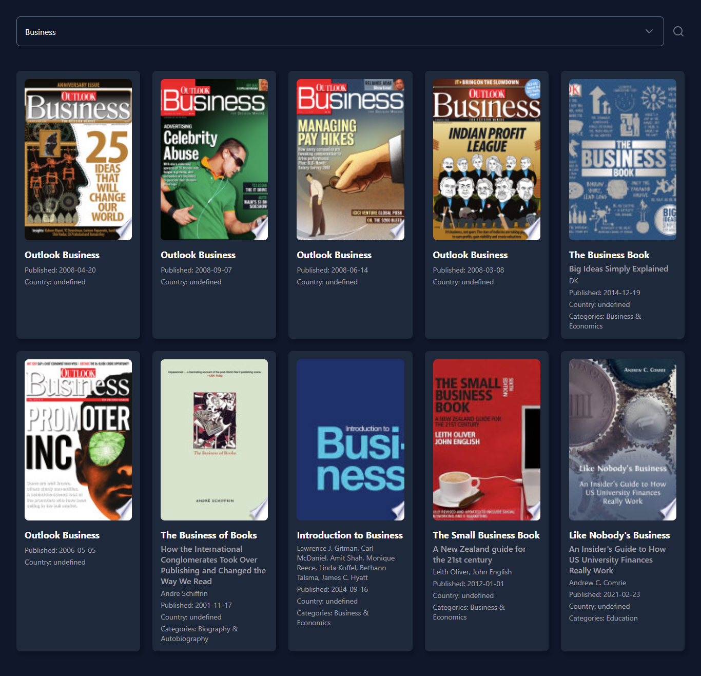
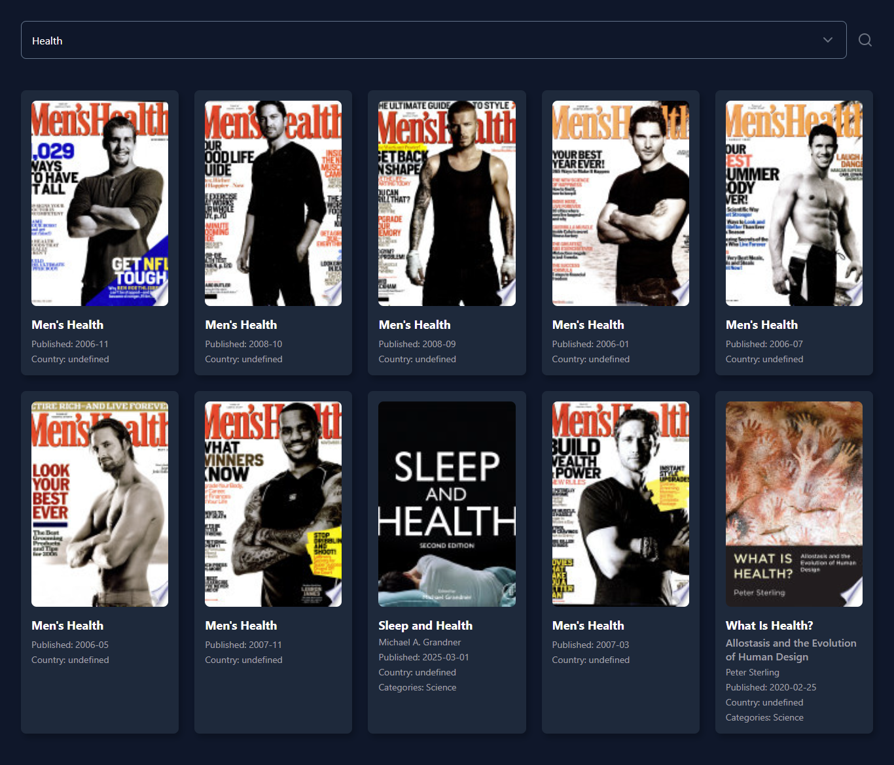
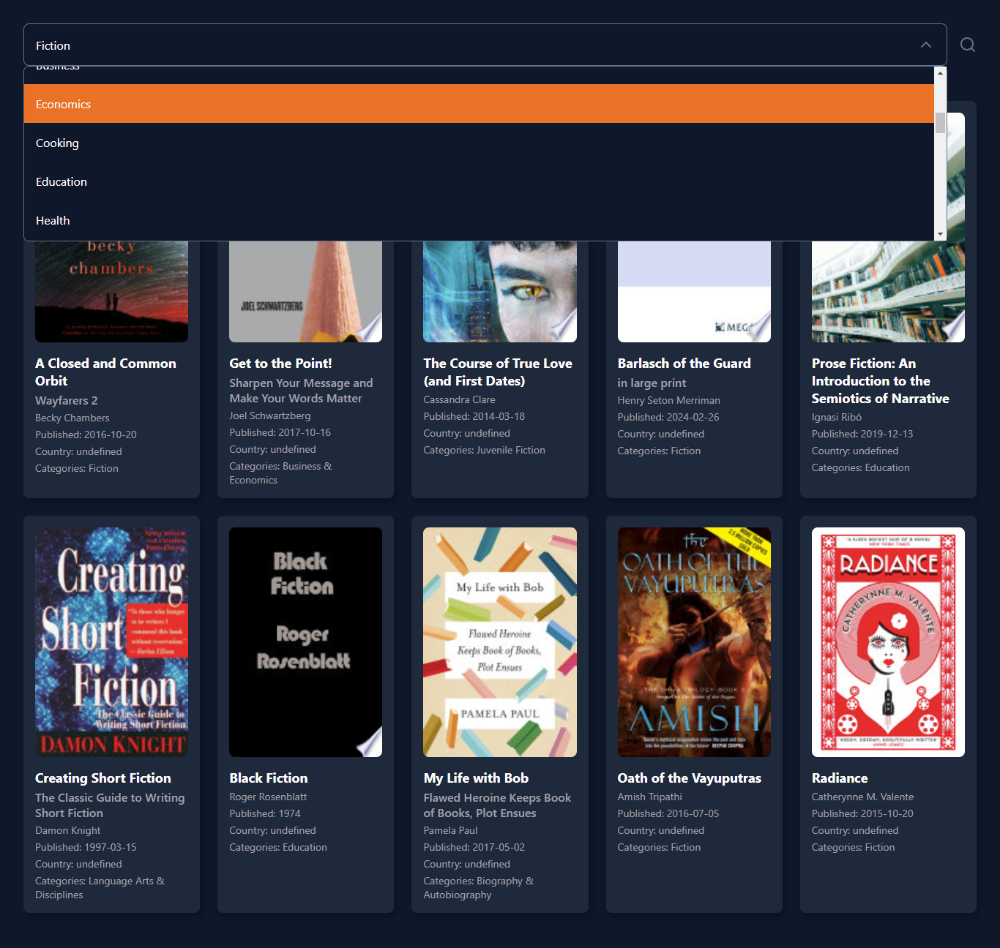

# BOOK LISTING

A React application that allows users to explore a collection of books. Users can filter books by category, view detailed information about each book, and potentially interact with the books in other ways.

## Home Page







## Features

*   **Book Filtering:** Users can filter books by category using a dropdown menu or other suitable UI elements.
*   **Book Details:** When a user clicks on a book card, a modal or separate page displays detailed information about that book, such as title, author(s), description, publication date, ISBN, and potentially cover image and reviews.

## Installation

1.  Clone the repository:

    ```bash
    git clone [https://github.com/RuwanPradeep0/Book-List-Using-Google-Book-API]
    ```

2.  Install dependencies:

    ```bash
    cd Book-List-Using-Google-Book-API
    npm install
    ```

## Running the Application

1.  Start the development server:

    ```bash
    npm start
    ```

    This will typically launch the application in your default web browser at `http://localhost:3000/`.

## Usage

1.  Open the application in your web browser.
2.  Explore the book listings.
3.  Use the filter options to narrow down the selection based on categories.


## Tech Stack

*   React
*   css

## License

[Choose a license, e.g., MIT License, Apache 2.0 License. If you don't want to use a license, you can remove this section.]
